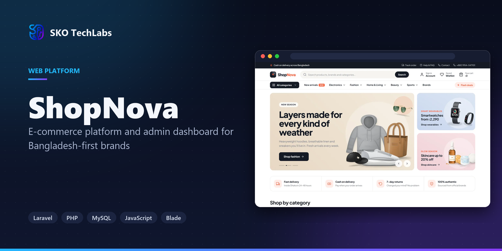
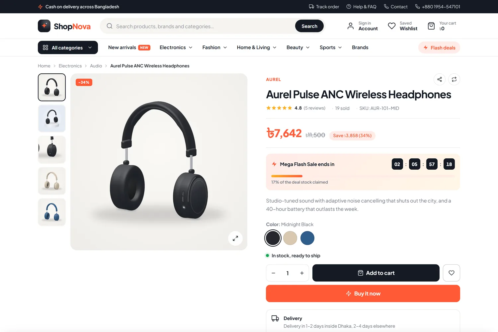
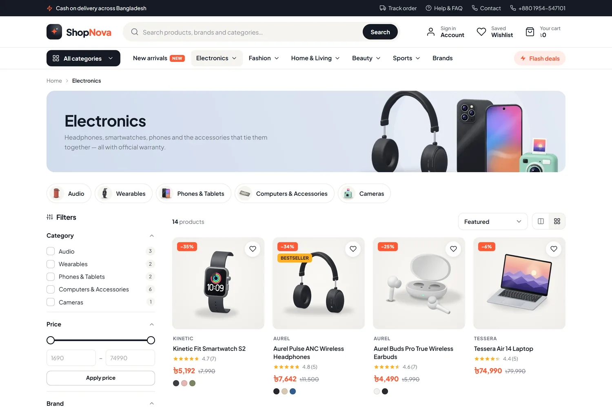
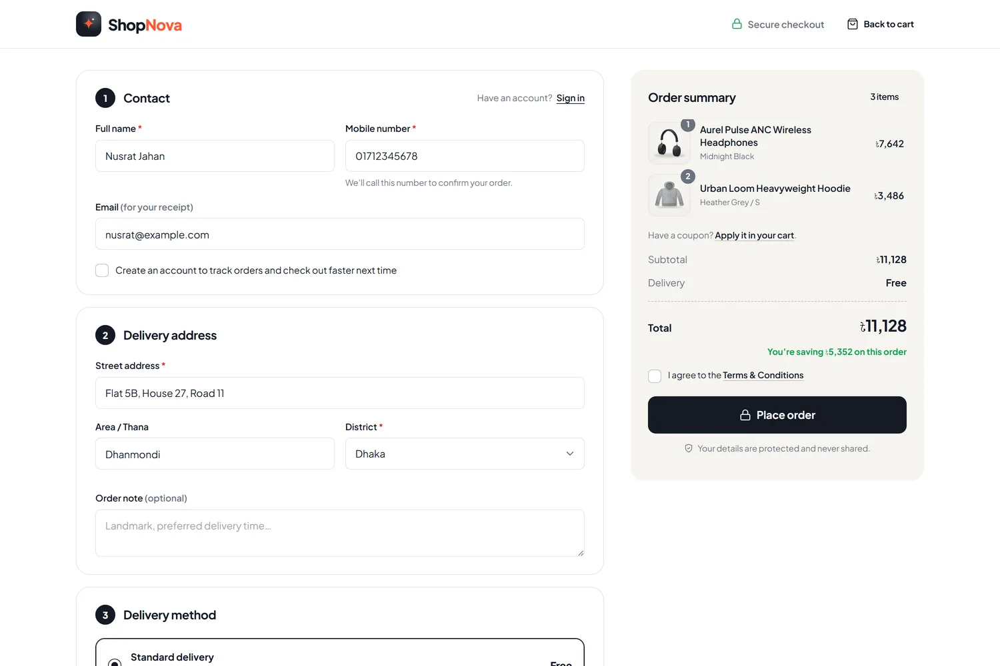
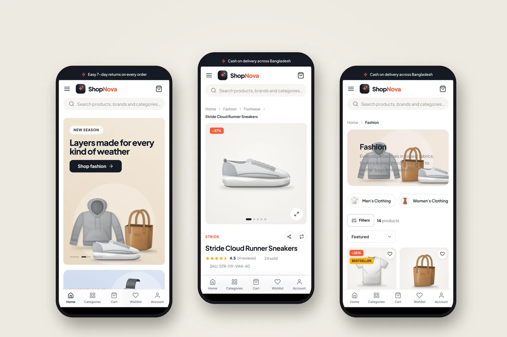
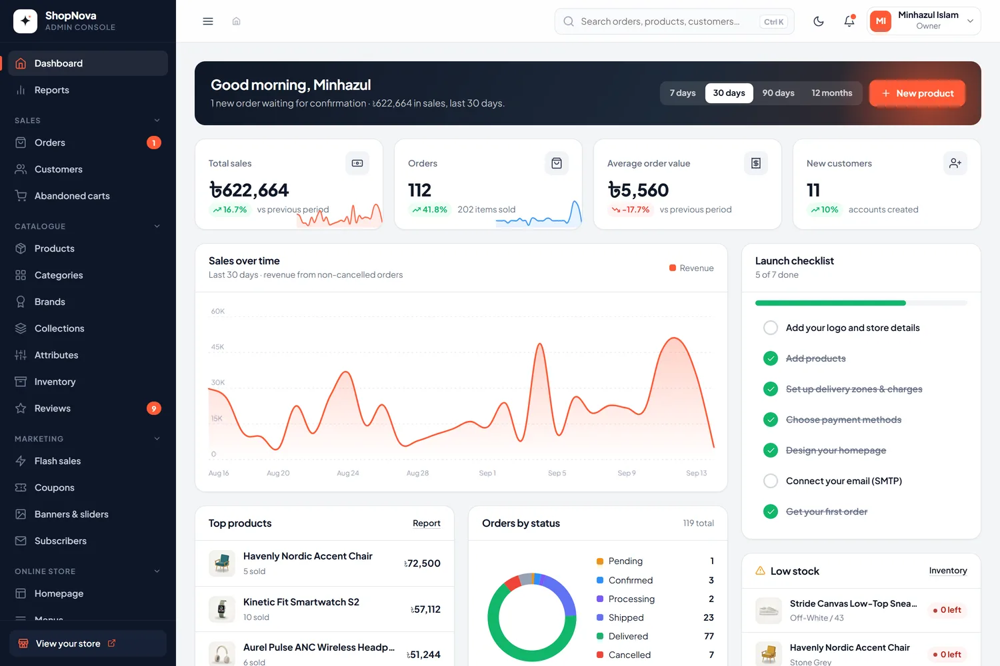
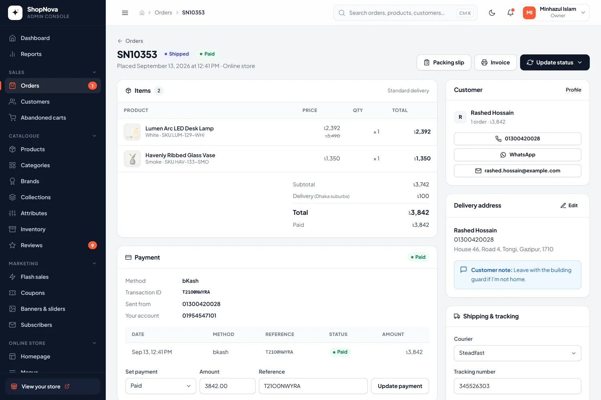
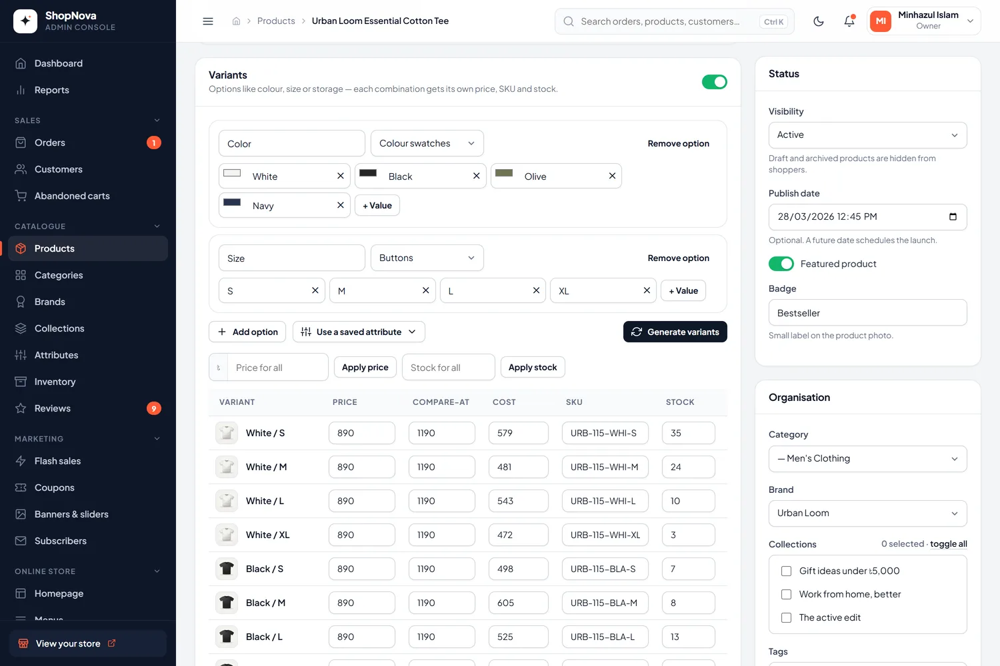
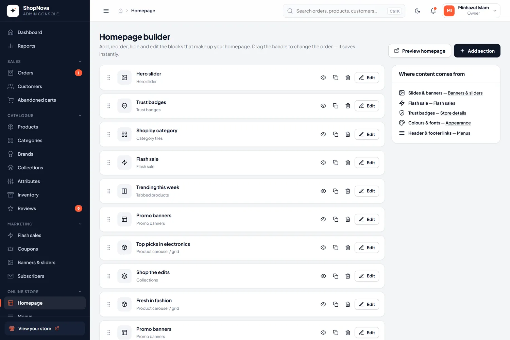

<h3>E-commerce platform and admin dashboard for Bangladesh-first brands</h3>

A complete online store for Bangladesh-first brands — a fast, mobile-first storefront with cash on delivery, bKash and card payments, and an admin dashboard that manages every product, order, page and colour without code.

   

<a href="https://shopnova.skotechlabs.com"><b>Live Demo</b></a> &nbsp;·&nbsp; <a href="https://skotechlabs.com/projects/shopnova-ecommerce-platform"><b>Case Study</b></a> &nbsp;·&nbsp; <a href="https://skotechlabs.com/contact"><b>Request a Demo</b></a> &nbsp;·&nbsp; <a href="https://github.com/skotechlabs"><b>All Products</b></a>

---

## Overview

ShopNova is an e-commerce platform built for brands selling across Bangladesh. Shoppers browse a fast, mobile-first storefront with a mega menu, instant search and filters, pick a colour or size and watch the photo and price change, then check out on a single page with cash on delivery, bKash, Nagad or a card.

Behind it sits an admin dashboard that runs the whole business: products with variants and per-variant stock, an order workflow that restocks cancelled items and records every payment and courier update, coupons and flash sales, reports and staff roles — plus a homepage builder, menus and theme settings, so the store can be redesigned and restocked without a developer.

<table>
<tr>
<td width="50%" valign="top">

### The Challenge

Many online shops in Bangladesh still run on a Facebook page and a spreadsheet: orders arrive as messages, stock is counted by hand, cash-on-delivery money is reconciled at the end of the month and every banner change waits for a developer. Generic store builders rarely fit local habits such as cash on delivery, bKash transaction IDs or delivery charges that depend on the district.

</td>
<td width="50%" valign="top">

### Our Solution

We built the storefront and the back office as one system. Every product has variants with their own price, stock and photo; one pricing service decides the selling price everywhere, flash sales included; and checkout re-checks prices, stock and the coupon inside a single transaction, so what the shopper sees is what gets charged. Orders move through a clear workflow that restocks cancelled items and logs every payment and courier update, and everything a shopper sees — homepage sections, banners, menus, colours and pages — is managed from the admin panel.

</td>
</tr>
</table>

## Key Features

- Homepage builder with 13 section types — hero slider, flash sale, tabbed products, banners, collections and more
- Products with colour and size variants, each with its own price, SKU, stock and photo
- Mega menu, instant search suggestions and filters by category, brand, price, colour, size and rating
- One-page checkout with district delivery charges, coupons, cash on delivery, bKash, Nagad and SSLCommerz cards
- Order workflow with a status timeline, payments, refunds, courier tracking, invoices and packing slips
- Stock ledger that records every sale, return, restock and adjustment with who made it and why
- Flash sales with countdowns and deal limits; percentage, fixed and free-delivery coupons
- Customer accounts with order tracking, reorder, saved addresses, wishlist and verified reviews
- Sales, product, customer, location, payment and coupon reports with CSV export
- Colours, fonts, menus, pages, blog, SEO and staff roles managed from the admin panel

## Business Impact

- Shoppers pay the way they prefer: cash on delivery, bKash, Nagad or card
- Prices, stock and totals agree between the product page, cart, checkout and invoice
- Every stock movement is traceable, from opening stock to returns
- Homepage sections, banners, menus and colours change in minutes, without a developer
- Order, fulfilment and content staff each see only the parts of the panel they need

## Screenshots

<table>
<tr>
<td width="50%" valign="top"> Product page with colour variants, flash-sale pricing and delivery promises</td>
<td width="50%" valign="top"> Category page with sub-categories, filters and quick add to cart</td>
</tr>
<tr>
<td width="50%" valign="top"> One-page checkout with delivery charges by district and cash on delivery</td>
<td width="50%" valign="top"> Mobile-first storefront: home, product and category pages</td>
</tr>
<tr>
<td width="50%" valign="top"> Admin dashboard with sales, order pipeline, top products and low stock</td>
<td width="50%" valign="top"> Order management with payments, courier tracking and a full timeline</td>
</tr>
<tr>
<td width="50%" valign="top"> Product editor with variants, per-variant price, SKU and stock</td>
<td width="50%" valign="top"> Homepage builder: add, reorder, hide and edit sections</td>
</tr>
</table>

> See it running: **[shopnova.skotechlabs.com](https://shopnova.skotechlabs.com)**

## Technology Stack

## Source Code & Licensing

This repository is the public showcase for **ShopNova**. The production source code is proprietary and is maintained privately by SKO TechLabs.

Interested in this product for your business? We offer:

- **Ready-to-launch deployment** of ShopNova under your own brand and domain
- **Customisation** of features, workflows, languages and integrations to fit how you work
- **Custom development** of a new product built on the same foundations
- **Ongoing support**, hosting, maintenance and feature roll-outs after launch

## Get in Touch

---

© 2026 <a href="https://skotechlabs.com">SKO TechLabs</a> · Dhaka, Bangladesh · Building intelligent digital solutions

